# Linear Models

Code (from scratch) for Linear Models with:

1. OLS exact Linear Regression w/ and w/o Kernels,
2. Stochastic Gradient Descent Linear Regression,
3. Stochastic Gradient Descent Logistic Regression

---

## Theory

Please note that the theory corresponding to the codes is hosted on this [page](https://parag1604.github.io/notes/Machine-Learning/Linear-Models)

## Python Environment Setup

This code is implemented from scratch and doesn't have a lot of requirements. Just make sure that numpy and matploitlib are installed in your environment.

## Linear Regression (OLS)

Execute the following to run the Ordinary Least Squares version of Linear Regression.

```bash
python linear_regression_exact.py
```

After training, you should get plots like the following:
Train             |  &nbsp;Test&nbsp;
:-------------------------:|:-------------------------:
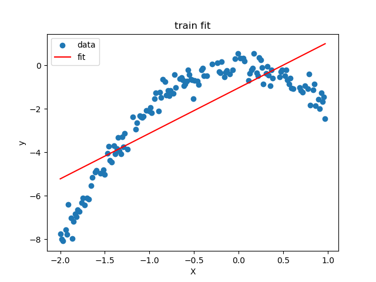  |  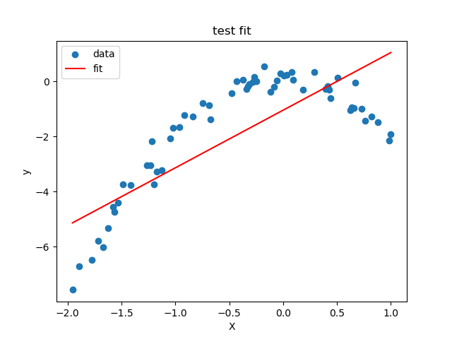

The loss and metrics on the dataset splits should be close to:

```bash
$ python linear_regression_exact.py
Train loss: 2.0600, metric: 1.2259
Test loss: 1.9515, metric: 1.1992
```

## Kernelized Linear Regression (Polynomial Regression)

Execute the following to run the Ordinary Least Squares version of Polynomial Regression

```bash
python linear_regression_exact.py True
```

After training, you should get plots like the following:
Train             |  &nbsp;Test&nbsp;
:-------------------------:|:-------------------------:
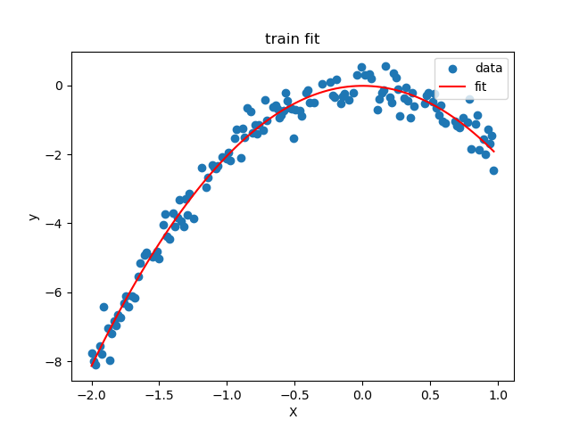  |  

The loss and metrics on the dataset splits should be close to:

```bash
$ python linear_regression_exact.py True
Train loss: 0.1202, metric: 0.2763
Test loss: 0.1307, metric: 0.2885
```

## Linear Regression with Stochastic Gradient Descent

Execute the following to run the simple version of Linear Regression using SGD (to get rid of the expensive matrix inverse operation in OLS):

```bash
python linear_regression_sgd.py
```

After training, you should get plots like the following:
Train             |  &nbsp;&nbsp;Val&nbsp;&nbsp;          |  &nbsp;Test&nbsp;
:----:|:----:|:----:
  |  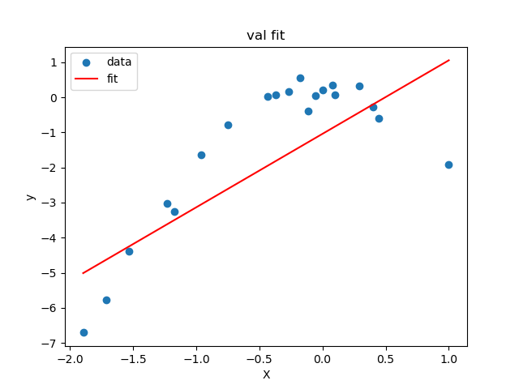 |  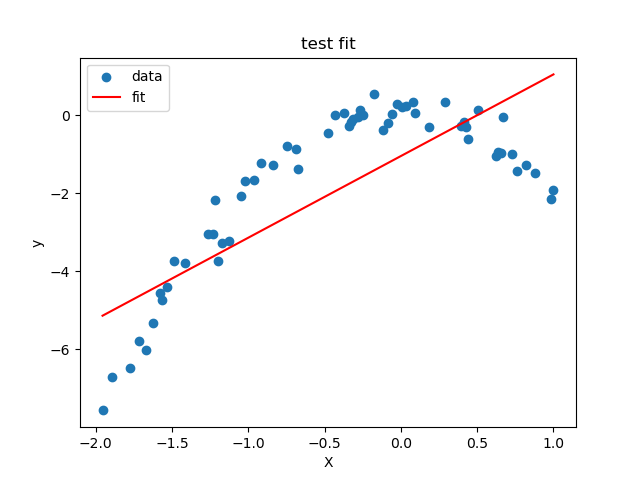

&nbsp;&nbsp;Loss (MSE)&nbsp;&nbsp;             |  Metric (MAE)
:-------------------------:|:-------------------------:
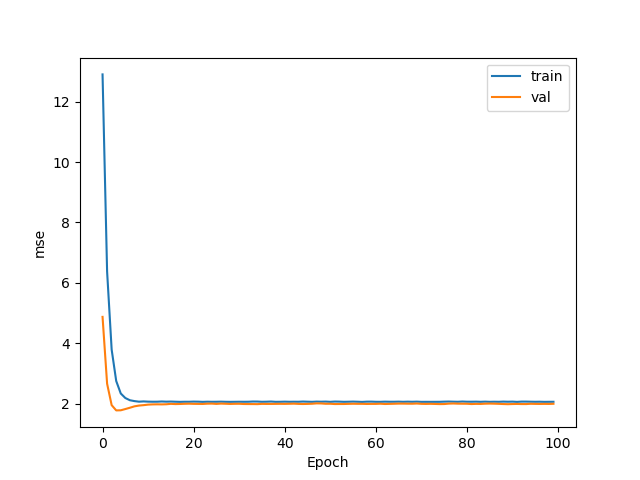  |  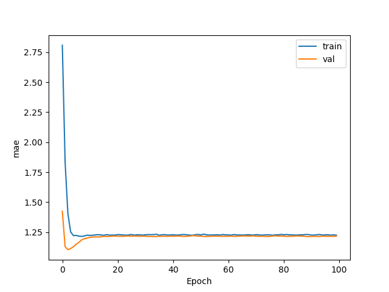

The loss and metrics on the dataset splits should be close to:

```bash
$ python linear_regression_sgd.py     
Epoch 1: train loss 12.9008, val loss 4.8753
Epoch 11: train loss 2.0697, val loss 1.9711
Epoch 21: train loss 2.0709, val loss 1.9964
Epoch 31: train loss 2.0662, val loss 1.9991
Epoch 41: train loss 2.0691, val loss 1.9955
Epoch 51: train loss 2.0632, val loss 1.9996
Epoch 61: train loss 2.0647, val loss 1.9951
Epoch 71: train loss 2.0625, val loss 1.9973
Epoch 81: train loss 2.0673, val loss 1.9998
Epoch 91: train loss 2.0702, val loss 1.9907
Train set performance: MSE 2.0600,  MAE 1.2260
Test set performance: MSE 1.9524,  MAE 1.1995
```

And alternatively the following for the kernelized version:

```bash
python linear_regression_sgd.py True
```

After training, you should get plots like the following:
Train             |  &nbsp;&nbsp;Val&nbsp;&nbsp;          |  &nbsp;Test&nbsp;
:----:|:----:|:----:
  |  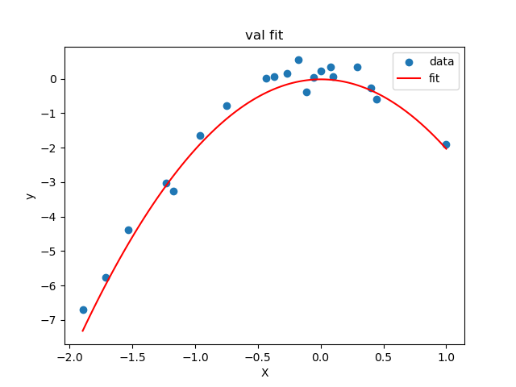 |  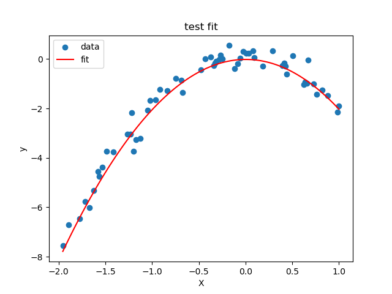

&nbsp;&nbsp;Loss (MSE)&nbsp;&nbsp;             |  Metric (MAE)
:-------------------------:|:-------------------------:
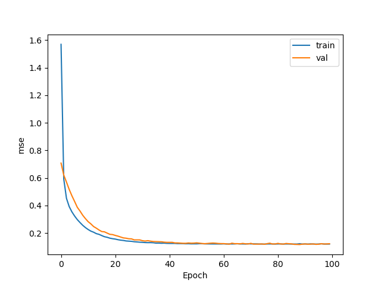  |  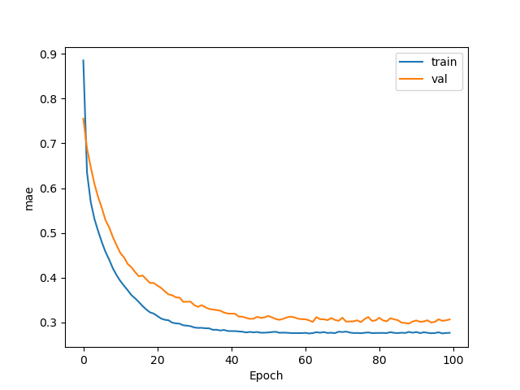

The loss and metrics on the dataset splits should be close to:

```bash
$ python linear_regression_sgd.py True  
Epoch 1: train loss 1.5692, val loss 0.7079
Epoch 11: train loss 0.2261, val loss 0.2829
Epoch 21: train loss 0.1567, val loss 0.1833
Epoch 31: train loss 0.1331, val loss 0.1450
Epoch 41: train loss 0.1253, val loss 0.1330
Epoch 51: train loss 0.1223, val loss 0.1294
Epoch 61: train loss 0.1221, val loss 0.1237
Epoch 71: train loss 0.1216, val loss 0.1258
Epoch 81: train loss 0.1213, val loss 0.1255
Epoch 91: train loss 0.1214, val loss 0.1215
Train set performance: MSE 0.1203,  MAE 0.2760
Test set performance: MSE 0.1326,  MAE 0.2916
```

## Logistic Regression with SGD

Execute the following to run the code for Logistic Regression

```bash
python logistic_regression.py
```

After training, you should get plots like the following:
Train             |  &nbsp;&nbsp;Val&nbsp;&nbsp;          |  &nbsp;Test&nbsp;
:----:|:----:|:----:
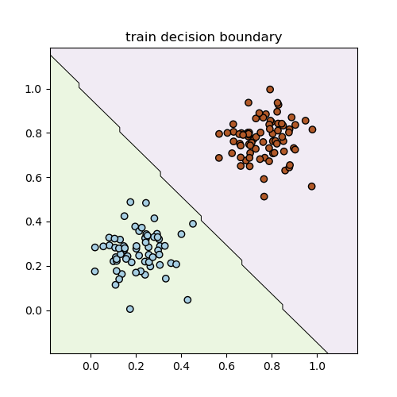  |  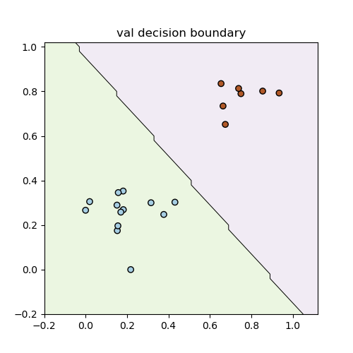 |  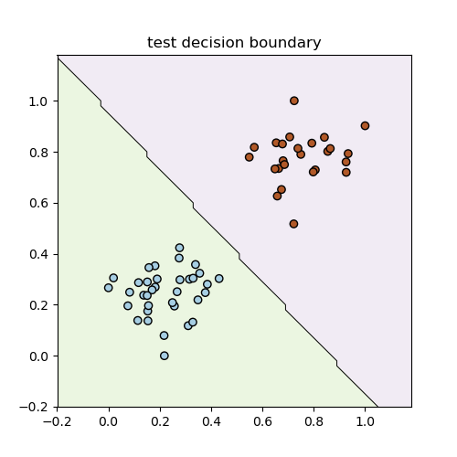

&nbsp;&nbsp;Loss (MSE)&nbsp;&nbsp;             |  Metric (MAE)
:-------------------------:|:-------------------------:
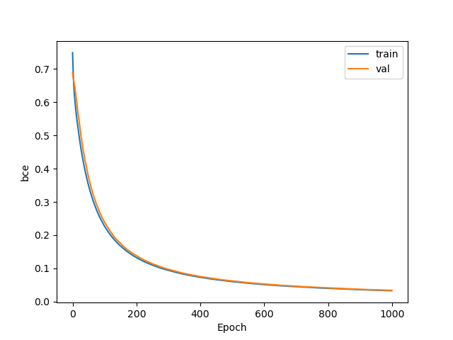  |  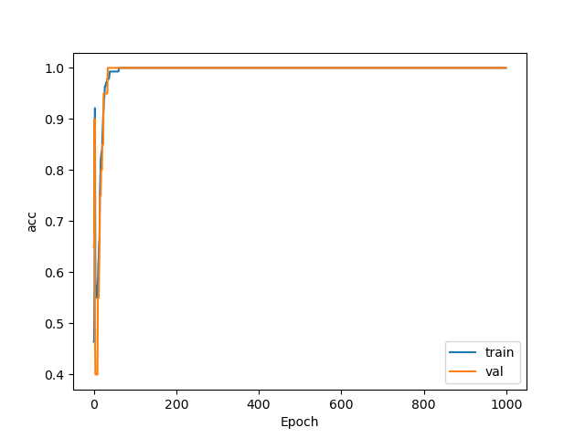

The loss and metrics on the dataset splits should be close to:

```bash
$ python logistic_regression.py  
Epoch 1: train loss 0.7490, val loss 0.6887, train acc 0.4643, val acc 0.6500
Epoch 2: train loss 0.7152, val loss 0.6795, train acc 0.4643, val acc 0.6500
.
.
.
Epoch 99: train loss 0.2304, val loss 0.2429, train acc 1.0000, val acc 1.0000
Epoch 100: train loss 0.2287, val loss 0.2411, train acc 1.0000, val acc 1.0000
.
.
.
Epoch 999: train loss 0.0329, val loss 0.0340, train acc 1.0000, val acc 1.0000
Epoch 1000: train loss 0.0329, val loss 0.0340, train acc 1.0000, val acc 1.0000
Train set performance: BCE 0.0329,  Acc 1.0000
Test set performance: BCE 0.0377,  Acc 1.0000
```
